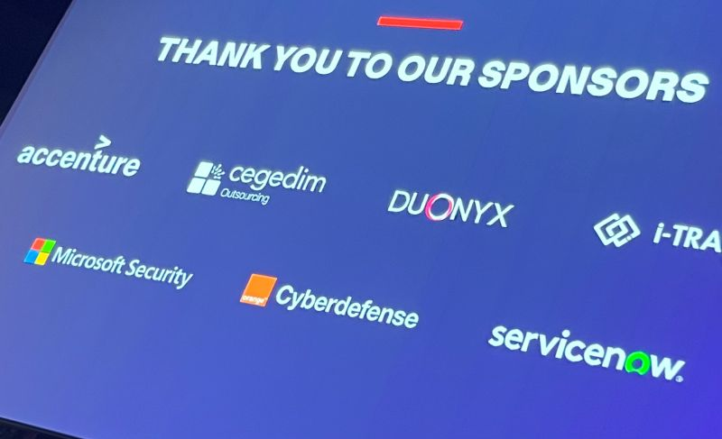
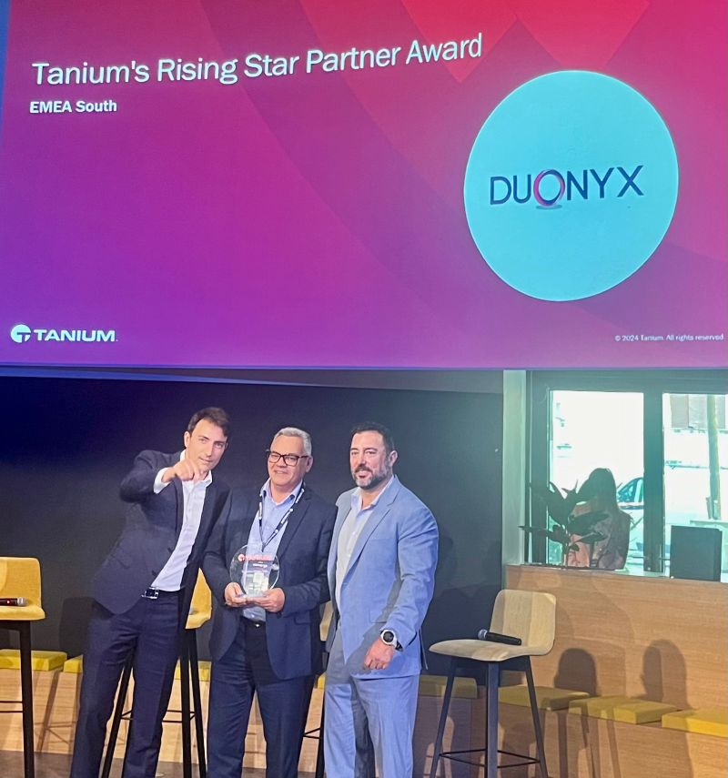
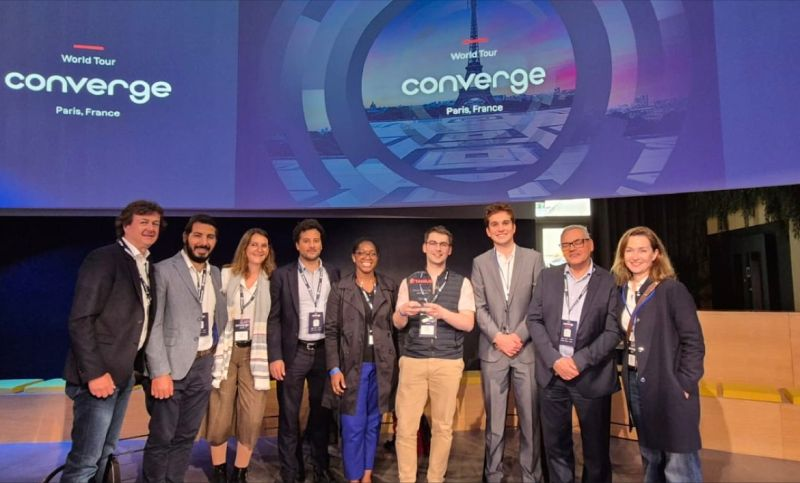

**Duonyx** était ravie d’être sponsor de **Tanium** au **Converge World Tour**, qui s'est tenu à Paris le 📆30 mai 2024, aux côtés notamment de **Microsoft Security**, **ServiceNow** et **Accenture**. 

{ .col-md-8 .img-fluid .d-flex .mx-auto .align-items-center .rounded .p1 .mb-4 }

Félicitations à toute l’équipe **Tanium** pour cette journée réussie.  
Merci pour la reconnaissance et votre confiance.  

{ .col-md-8 .img-fluid .d-flex .mx-auto .align-items-center .rounded .p1 .mb-4 }

Bravo aux équipes **Duonyx Cybersecurity Consulting** 🏆

{ .col-md-8 .img-fluid .d-flex .mx-auto .align-items-center .rounded .p1 .mb-4 }
